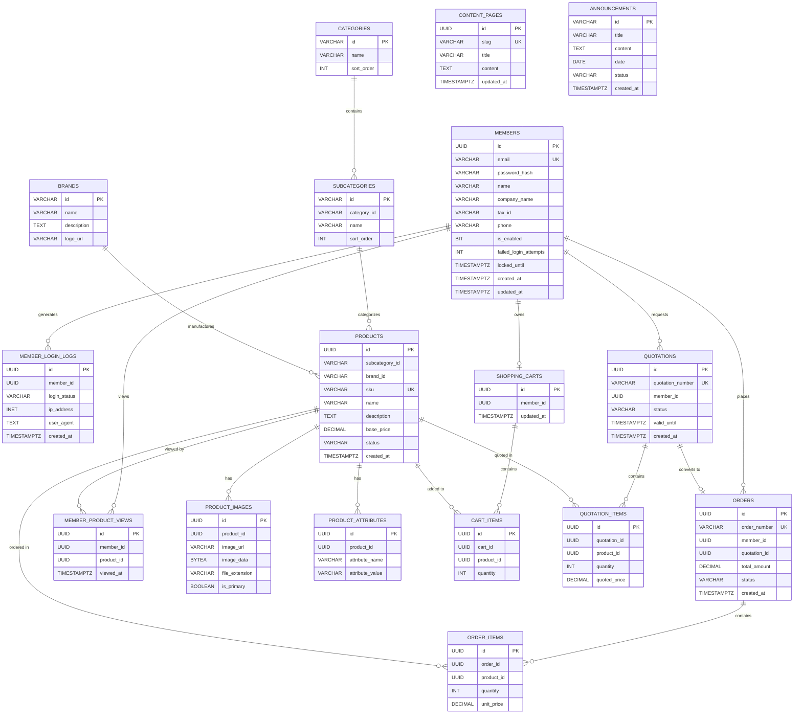

# 翔盛五金 B2B 平台 Database Schema

## 一、 架構設計

1. **第三正規化（3NF）落實**：消除資料重複與傳遞相依。例如，訂單明細（`order_items`）中直接紀錄 `unit_price`，避免未來 `products` 價格變更時影響歷史訂單紀錄。
2. **PostgreSQL 專屬型別**：大量採用 `UUID` 作為主鍵以提升安全性與分散式擴展能力；針對登入紀錄的 IP 欄位採用原生 `INET` 型別。
3. **操作紀錄（Trace Log）**：獨立抽出 `member_login_logs` 資料表，保留完整的登入成功、失敗與設備資訊，符合資安稽核要求。
4. **報價與購買的轉換**：企業 B2B 特性中，報價單（`quotations`）與訂單（`orders`）為獨立實體，訂單可關聯回報價單（`quotation_id`），滿足商業邏輯。

---

## 二、 ER-Model (實體關聯圖)

---

## 三、 Table Schema

### 1. 會員與安全系統 (Member & Security)

#### `members` (會員資料)
| 欄位名稱 | 型別 | 鍵 | 說明 |
| :--- | :--- | :--- | :--- |
| `id` | UUID | PK | 會員唯一識別碼 |
| `email` | VARCHAR(255) | UK | 登入帳號 / Email |
| `password_hash` | VARCHAR(255) | | 加密後的密碼 |
| `name` | VARCHAR(100) | | 聯絡人姓名 |
| `company_name` | VARCHAR(100) | | 公司名稱 |
| `tax_id` | VARCHAR(20) | | 統一編號 |
| `phone` | VARCHAR(50) | | 聯絡電話 |
| `is_enabled` | BIT(1) | | 狀態 (1:正常, 0:停用) |
| `failed_login_attempts` | INT | | 連續登入失敗次數 (預設 0，達 5 次則鎖定)，每次登入成功歸零 |
| `locked_until` | TIMESTAMPTZ | | 帳號解鎖時間 (空值代表未鎖定，鎖定時間預設為24小時)，每次重新登入成功重設空值 |
| `created_at` | TIMESTAMPTZ | | 建立時間 |
| `updated_at` | TIMESTAMPTZ | | 更新時間 |

#### `member_login_logs` (會員登入操作紀錄)
| 欄位名稱 | 型別 | 鍵 | 說明 |
| :--- | :--- | :--- | :--- |
| `id` | UUID | PK | 紀錄唯一識別碼 |
| `member_id` | UUID | | 關聯至 `members.id` |
| `login_status` | VARCHAR(20) | | 登入狀態 (success, failed) |
| `ip_address` | INET | | 來源 IP 位置 |
| `user_agent` | TEXT | | 瀏覽器與裝置資訊 |
| `created_at` | TIMESTAMPTZ | | 發生時間 |

### 2. 會員行為分析 (Behavior Analysis)

#### `member_product_views` (商品訪問紀錄)
| 欄位名稱 | 型別 | 鍵 | 說明 |
| :--- | :--- | :--- | :--- |
| `id` | UUID | PK | 紀錄唯一識別碼 |
| `member_id` | UUID | | 關聯至 `members.id` |
| `product_id` | UUID | | 關聯至 `products.id` |
| `viewed_at` | TIMESTAMPTZ | | 訪問時間 |

### 3. 產品目錄系統 (Product Catalog)

#### `categories` (產品類別)
| 欄位名稱 | 型別 | 鍵 | 說明 |
| :--- | :--- | :--- | :--- |
| `id` | VARCHAR(50) | PK | 類別唯一識別碼 (支援自定義編碼) |
| `name` | VARCHAR(100) | | 類別名稱 (如：電動工具) |
| `sort_order` | INT | | 顯示排序 |

#### `subcategories` (產品子類別)
| 欄位名稱 | 型別 | 鍵 | 說明 |
| :--- | :--- | :--- | :--- |
| `id` | VARCHAR(50) | PK | 子類別唯一識別碼 (支援自定義編碼) |
| `category_id` | VARCHAR(50) | | 關聯至 `categories.id` |
| `name` | VARCHAR(100) | | 子類別名稱 (如：電動起子機) |
| `sort_order` | INT | | 顯示排序 |

#### `brands` (品牌代碼檔)
| 欄位名稱 | 型別 | 鍵 | 說明 |
| :--- | :--- | :--- | :--- |
| `id` | VARCHAR(50) | PK | 品牌代碼 (支援自定義編碼，如：BOSCH, DEWALT) |
| `name` | VARCHAR(100) | | 品牌名稱 |
| `description` | TEXT | | 品牌簡介 |
| `logo_url` | VARCHAR(255) | | 品牌 Logo 圖片網址 |

#### `products` (產品明細)
| 欄位名稱 | 型別 | 鍵 | 說明 |
| :--- | :--- | :--- | :--- |
| `id` | UUID | PK | 產品唯一識別碼 |
| `subcategory_id` | VARCHAR(50) | | 關聯至 `subcategories.id` |
| `brand_id` | VARCHAR(50) | | 關聯至 `brands.id` |
| `sku` | VARCHAR(100) | UK | 庫存單位編號 |
| `name` | VARCHAR(255) | | 產品名稱 |
| `description` | TEXT | | 產品詳細描述 |
| `base_price` | DECIMAL(10,2) | | 基礎單價(台幣) |
| `status` | VARCHAR(20) | | 狀態 (active, inactive) |
| `created_at` | TIMESTAMPTZ | | 建立時間 |

#### `product_images` (產品圖片)
| 欄位名稱 | 型別 | 鍵 | 說明 |
| :--- | :--- | :--- | :--- |
| `id` | UUID | PK | 圖片唯一識別碼 |
| `product_id` | UUID | | 關聯至 `products.id` |
| `image_url` | VARCHAR(255) | | 圖片網址 (可選用，適用於外部圖床) |
| `image_data` | BYTEA | | 圖片二進位資料 (可選用，適用於 DB 直接儲存) |
| `file_extension` | VARCHAR(10) | | 圖片副檔名 (如：png, jpg, webp) |
| `is_primary` | BOOLEAN | | 是否為主要封面圖 |

#### `product_attributes` (產品規格/屬性)
| 欄位名稱 | 型別 | 鍵 | 說明 |
| :--- | :--- | :--- | :--- |
| `id` | UUID | PK | 規格唯一識別碼 |
| `product_id` | UUID | | 關聯至 `products.id` |
| `attribute_name` | VARCHAR(100) | | 規格名稱 (如：電池容量、配置) |
| `attribute_value` | VARCHAR(255) | | 規格值 (如：4.0Ah High Capacity) |

### 4. 交易與購物車系統 (Transaction & Cart)

#### `shopping_carts` (購物車 - 綁定會員)
| 欄位名稱 | 型別 | 鍵 | 說明 |
| :--- | :--- | :--- | :--- |
| `id` | UUID | PK | 購物車唯一識別碼 |
| `member_id` | UUID | UK | 關聯至 `members.id` (一對一) |
| `updated_at` | TIMESTAMPTZ | | 最後更新時間 |

#### `cart_items` (購物車內容)
| 欄位名稱 | 型別 | 鍵 | 說明 |
| :--- | :--- | :--- | :--- |
| `id` | UUID | PK | 項目唯一識別碼 |
| `cart_id` | UUID | | 關聯至 `shopping_carts.id` |
| `product_id` | UUID | | 關聯至 `products.id` |
| `quantity` | INT | | 購買數量 |

#### `quotations` (電子報價單)
| 欄位名稱 | 型別 | 鍵 | 說明 |
| :--- | :--- | :--- | :--- |
| `id` | UUID | PK | 報價單唯一識別碼 |
| `quotation_number` | VARCHAR(50) | UK | 報價單號 (自動生成，格式：yyyyMMdd + 4碼流水號) |
| `member_id` | UUID | | 關聯至 `members.id` |
| `status` | VARCHAR(20) | | 狀態 (pending, approved, expired) |
| `valid_until` | TIMESTAMPTZ | | 報價單有效期限 |
| `created_at` | TIMESTAMPTZ | | 建立時間 |

#### `quotation_items` (報價單明細)
| 欄位名稱 | 型別 | 鍵 | 說明 |
| :--- | :--- | :--- | :--- |
| `id` | UUID | PK | 明細唯一識別碼 |
| `quotation_id` | UUID | | 關聯至 `quotations.id` |
| `product_id` | UUID | | 關聯至 `products.id` |
| `quantity` | INT | | 詢價數量 |
| `quoted_price` | DECIMAL(10,2) | | 報價單價 (紀錄當時報價，不受原價變更影響) |

#### `orders` (購買歷史紀錄 / 訂單)
| 欄位名稱 | 型別 | 鍵 | 說明 |
| :--- | :--- | :--- | :--- |
| `id` | UUID | PK | 訂單唯一識別碼 |
| `order_number` | VARCHAR(50) | UK | 訂單編號 (自動生成，格式：yyyyMMdd + 4碼流水號) |
| `member_id` | UUID | | 關聯至 `members.id` |
| `quotation_id` | UUID | | (可選) 若由報價單轉單，關聯至 `quotations.id` |
| `total_amount` | DECIMAL(12,2) | | 訂單總金額 |
| `status` | VARCHAR(30) | | 訂單狀態 (pending, paid, processing, shipped) |
| `created_at` | TIMESTAMPTZ | | 建立時間 (購買時間) |

#### `order_items` (訂單明細)
| 欄位名稱 | 型別 | 鍵 | 說明 |
| :--- | :--- | :--- | :--- |
| `id` | UUID | PK | 明細唯一識別碼 |
| `order_id` | UUID | | 關聯至 `orders.id` |
| `product_id` | UUID | | 關聯至 `products.id` |
| `quantity` | INT | | 購買數量 |
| `unit_price` | DECIMAL(10,2) | | 購買時的歷史單價 (避免傳遞相依) |

### 5. 靜態內容管理 (Static Content)

#### `content_pages` (靜態頁面內容)
| 欄位名稱 | 型別 | 鍵 | 說明 |
| :--- | :--- | :--- | :--- |
| `id` | UUID | PK | 頁面唯一識別碼 |
| `slug` | VARCHAR(50) | UK | 網址代稱 (如：about-us, faq) |
| `title` | VARCHAR(150) | | 頁面標題 |
| `content` | TEXT | | HTML 或 Markdown 內容 |
| `updated_at` | TIMESTAMPTZ | | 最後更新時間 |

#### `announcements` (平台公告)
| 欄位名稱 | 型別 | 鍵 | 說明 |
| :--- | :--- | :--- | :--- |
| `id` | VARCHAR(50) | PK | 公告唯一識別碼 |
| `title` | VARCHAR(255) | | 公告標題 |
| `content` | TEXT | | 公告詳細內容 |
| `date` | DATE | | 公告發布日期 |
| `status` | VARCHAR(20) | | 公告狀態 (如：新活動、公告、更新) |
| `created_at` | TIMESTAMPTZ | | 建立時間 |

---

### 四、 Schema 設計總結

1. **第三正規化 (3NF) 的體現**：
   * 在 `quotation_items` 與 `order_items` 中，皆獨立紀錄 `quoted_price` 與 `unit_price`。確保「歷史交易紀錄」不會因為未來 `products.base_price` 的異動而跟著改變（消除傳遞相依）。
2. **會員追蹤稽核 (Trace Log)**：
   * `member_login_logs` 使用 PostgreSQL 特有的 `INET` 型別來精確儲存 IPv4/IPv6 地址，並紀錄了 `action` (登入成功/失敗)，完全符合資安稽核標準。
3. **報價轉單彈性**：
   * B2B 業務中常有「先詢價，後購買」的流程。`orders` 表中的 `quotation_id` 允許一筆訂單追溯其來源的報價單，提供完整的商業漏斗數據。
4. **單號生成策略 (編碼原則)**：
   * 報價單與訂單編號採用 `{yyyyMMdd} + 4碼流水號` 格式（如：`202604280001`）。此設計具備高可讀性、天然排序優勢，並能隱藏真實總接單量。實作上建議由後端 API 搭配 Redis 的原子性遞增（Atomic Increment）或 DB 鎖機制來防止併發衝突。
